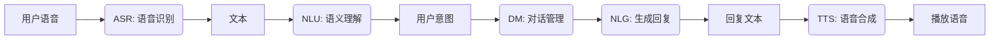
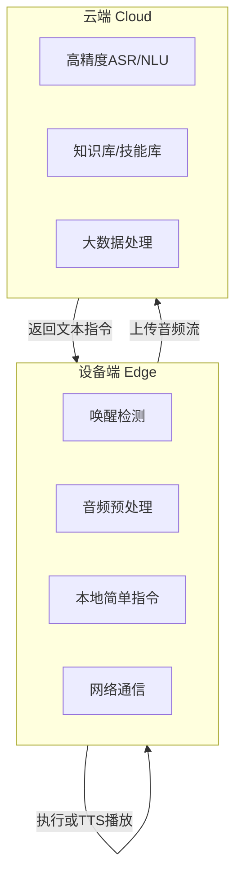

<!-- 开场与引入 -->

# 人工智能语音技术与中医药应用

### 基于小智AI开源项目的实践与探索

<br>

 <!-- 请替换为实际logo URL -->

---
## 分享人：XXX

- **角色**：XXX工程师/项目负责人
- **领域**：人工智能、自然语言处理
- **目标**：与各位一同探索AI语音技术在中医药领域的无限可能 

---
## 今日议程

1.  **人工智能基础理论** - 揭开AI的神秘面纱
2.  **语音交互设备解析** - 从麦克风到应答的旅程
3.  **小智AI项目介绍** - 开源的力量
4.  **后台调试实操演示** - 手把手的实战环节
5.  **互动体验与讨论** - 畅所欲言，碰撞思想

---

<!-- 人工智能基础理论 -->
## 一、人工智能基础理论

从概念到应用，构建知识体系

---
### 人工智能：概念与发展

<div class="container">
<div class="col">

**什么是人工智能 (AI)?**
- 让机器模拟人类智能的科学与工程
- **机器学习 (ML)**：基于数据自动学习模式
- **深度学习 (DL)**：使用深层神经网络进行学习

</div>
<div class="col">

 <!-- 建议替换为更合适的示意图 -->

</div>
</div>

---
### AI在医疗健康领域的应用

- **医学影像分析**：CT、X光片辅助诊断
- **药物研发**：加速分子筛选与模拟
- **健康管理**：个性化健康建议与风险预测
- **智慧医院**：流程优化与智能导诊

---
### 自然语言处理 (NLP) 技术栈

| 技术环节 | 英文缩写 | 功能 | 比喻 |
| :--- | :--- | :--- | :--- |
| **语音识别** | ASR | 语音 → 文字 | **耳朵** |
| **自然语言理解** | NLU | 文字 → 意图 | **大脑** |
| **对话管理** | DM | 决策如何回应 | **思维** |
| **自然语言生成** | NLG | 意图 → 文字 | **想法** |
| **语音合成** | TTS | 文字 → 语音 | **嘴巴** |

---
### NLP流程全景图



---
### 中医药领域的AI潜力

- **智能问诊助手**：初步收集病史与症状
- **古籍知识挖掘**：从经典中发现新洞见
- **方剂推荐系统**：基于证候的智能推荐
- **中医药教育**：沉浸式、交互式学习工具

---

<!-- 语音交互设备技术解析 -->
## 二、语音交互设备技术解析

硬件与软件的完美协奏

---
### 设备硬件组成

<div class="container">
<div class="col">

- **“耳朵” - 麦克风阵列**
  - 远场拾音
  - 声源定位
  - 降噪处理

- **“大脑” - 处理器**
  - CPU/GPU算力
  - 神经网络计算单元 (NPU)

</div>
<div class="col">

- **“嘴巴” - 扬声器**
  - 语音播放与反馈

- **“躯干” - 连接与接口**
  - Wi-Fi/蓝牙
  - 电源管理

</div>
</div>

 <!-- 建议替换为设备拆解图 -->

---
### 软件架构：云端协同


**优势**：本地快速响应 + 云端强大算力

---
### 医疗场景的特殊考量

- **隐私与安全**
  - 数据传输加密
  - 本地化处理敏感信息
- **环境适应性**
  - 医院嘈杂环境的降噪
  - 专业术语的高准确度识别
  - 离线模式保障基础功能

---

<!-- 小智AI开源项目介绍 -->
## 三、小智AI开源项目介绍

开放、共享、赋能

---
### 项目背景与特点

- **技术栈**：Python + Vue.js + 通用AI模型
- **核心特点**：
  - 🛠 **高度模块化**：易于定制和扩展
  - 🧩 **技能热插拔**：灵活添加新功能
  - 🌐 **开放生态**：社区共同贡献技能
  - 🏠 **本地部署**：保障数据隐私安全

---
### 系统架构图


<!-- 此处应替换为实际的系统架构图，展示唤醒、ASR、NLU、DM、技能、TTS等模块 -->

---
### 为何选择开源？

- **透明度**：代码可见，安全可控
- **协作性**：集众人之力，快速迭代
- **教育性**：最佳的学习与实验平台
- **生态化**：共建中医药AI生态

---

<!-- 实操演示 -->
## 四、实操演示：后台调试

让设备“听懂”中医药

---
### 1. 开发环境一览

```bash
# 克隆项目
git clone https://github.com/your-username/xiaoai-project.git

# 安装依赖
pip install -r requirements.txt

# 主要配置文件
config/
├── settings.yml    # 主设置
├── wake_words.txt  # 唤醒词
├── nlu_model/      # 语义理解模型
└── skills/         # 技能目录
```

---
### 2. 配置唤醒词

```yaml
# wake_words.txt
小智小智
灵芝灵芝 <!-- 可定制为中医药相关唤醒词 -->
```

**演示**：修改唤醒词并热重载，测试效果。

---
### 3. 管理对话技能 - NLU模型训练

```yaml
# 在NLU模型数据文件中添加中医药意图样本
nlu:
- intent: ask_herb_property
  examples: |
    - [当归]的功效是什么？
    - 介绍一下[黄芪]的性味归经
    - [甘草]有什么作用？
    - [丹参]是寒性的还是温性的？
```

**演示**：添加一个关于“查询药材属性”的新意图并训练模型。

---
### 4. 管理对话技能 - 编写逻辑

```python
# skills/herb_skill.py
@skill_route(intent='ask_herb_property')
def handle_herb_property(request):
    herb_name = request.slots.get('herb_name') # 提取实体，如“当归”
    # 从数据库或知识图谱中查询信息
    herb_info = database.query(f"SELECT * FROM herbs WHERE name='{herb_name}'")
    # 组织回复文本
    response_text = f"{herb_name}的功效是：{herb_info.property}..."
    return respond(text=response_text)
```

**演示**：编写一个简单的技能逻辑，并测试对话流。

---
### 5. 调试与排查

- **问题**：设备无法唤醒
  - **排查**：检查麦克风权限、音频输入设备配置
- **问题**：答非所问
  - **排查**：查看NLU识别结果，补充训练样本
- **问题**：响应延迟高
  - **排查**：优化网络或启用更多本地处理

---

<!-- 学员互动环节 -->
## 五、互动体验与讨论

---
### 环节一：设备体验

现在，邀请几位同学来与我们的“AI中医小助手”对话吧！

**可以尝试以下问题：**
- “小智小智，你好！”
- “当归有什么作用？”
- “感冒了怎么办？”

---
### 环节二：Q&A

请大家自由提问

- ❓关于刚才讲到的技术
- ❓关于项目本身
- ❓关于在您工作/学习中的应用设想

---
### 环节三：创意Brainstorming

**假设我们有一台能听会说、懂中医的AI设备，我们可以用它来做什么？**

- 在**临床**上？
- 在**教学中**？
- 在**科研中**？
- 在**养生保健**中？

---

<!-- 总结与展望 -->
## 六、总结与展望

---
## 核心内容回顾

1.  **理论**：了解了AI、NLP的基本原理和在中医药的应用潜力。
2.  **设备**：拆解了语音交互设备的硬件和软件技术要点。
3.  **项目**：认识了小智AI开源项目的特色与优势。
4.  **实践**：掌握了后台调试和技能开发的基本流程。

---
## 未来的趋势

- **更精准**：专门为中医药语言优化的NLP模型
- **更融合**：与可穿戴设备结合，实现“AI+中医+健康管理”
- **更智能**：从问答走向主动感知、决策辅助

---
## 学习资源推荐

- **小智AI项目地址**：https://github.com/your-username/xiaoai-project
- **人工智能入门**：吴恩达《机器学习》课程
- **自然语言处理**：《Speech and Language Processing》书籍
- **中医药知识图谱**：相关论文与开源数据集

---
# 感谢聆听！

### 欢迎交流与合作

<br>

**联系方式**：
- Email: your.email@example.com
- GitHub: your_github_username

**Q&A**
