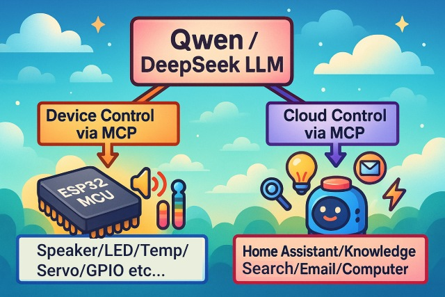
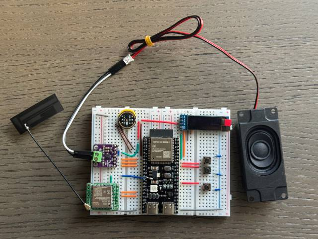
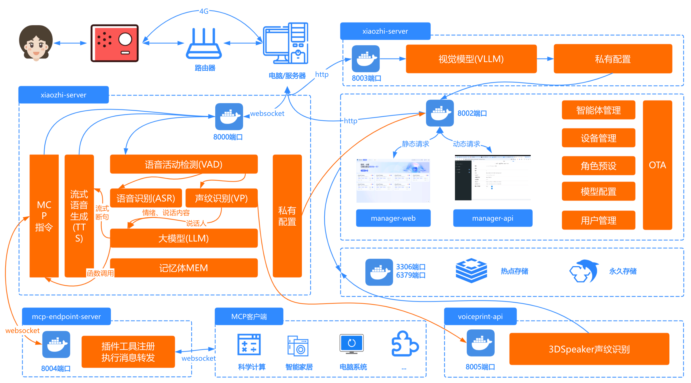

## AI聊天机器人分享

Note: 欢迎各位参加本次分享，我是[您的姓名]，今天将为大家介绍AI聊天机器人的相关知识。

---

## 目录

- AI聊天机器人基础知识
- 语音设备硬件介绍
- 小智AI聊天机器人整体架构
- 后台调试操作演示
- 设备展示与学员互动
- 总结与Q&A

---

<iframe src="//player.bilibili.com/player.html?isOutside=true&aid=114991206308373&bvid=BV1C1tCzUEZh&cid=31777686642&p=1" scrolling="no" border="0" frameborder="no" framespacing="0" allowfullscreen="true" style=" width: 100%; height: 600px; border: none;"></iframe>
---

## AI聊天机器人理论基础

- 基于自然语言处理（NLP）的交互系统
- 核心组件：
  - 语音识别（ASR）
  - 自然语言理解（NLU） 
  - 语音合成（TTS）
- 应用场景：智能家居、医疗辅助、教育互动

 
---

## 语音设备硬件概述

- ESP32开源硬件平台
- 支持70+开发板：
  - 立创ESP32-S3
  - 乐鑫ESP32-S3-BOX3
  - M5Stack CoreS3

 

---
## 小智AI聊天机器人整体架构

小智AI聊天机器人的架构采用模块化设计，分为硬件和软件两大部分，实现完整的语音交互功能。
 

**硬件架构**：
- 基于ESP32系列开发板，支持70多种开源硬件平台
- 包括立创ESP32-S3、乐鑫ESP32-S3-BOX3、M5Stack CoreS3等开发板
- 提供Wi-Fi/4G通信能力，支持离线语音唤醒、显示屏和电量管理

**软件架构**：
- 核心基于WebSocket和HTTP服务器，提供控制台管理和认证系统
- 功能模块：
  - 语音交互模块：支持流式ASR语音识别、TTS语音合成、VAD检测
  - 声纹识别模块：可识别说话人身份
  - 视觉感知模块：支持拍照识物等功能
  - IOT控制模块：通过MCP协议实现设备控制

**部署方式**：
- 最简化安装：适合低配置环境，数据存储在配置文件
- 全模块安装：提供完整功能体验，包括智能对话、IOT控制等

---

## 后台调试操作

- 部署方式：
  - Docker版部署
  - 源码部署
- 功能支持：
  - 自定义音色
  - IOT控制
  - 语音识别

---

## 功能演示案例

- 医疗救护车场景
- 粤语交流支持
- 实时打断功能
- 拍照识物品

<iframe src="//player.bilibili.com/player.html?isOutside=true&aid=114232070772186&bvid=BV1N5ZMYUE4D&cid=29088680983&p=1" scrolling="no" border="0" frameborder="no" framespacing="0" allowfullscreen="true" style=" width: 400px; height: 600px; border: none;"></iframe>

---

## 资源推荐

- 小智AI GitHub仓库：
  https://github.com/78/xiaozhi-esp32 [1]
- 后端服务文档：
  https://github.com/xinnan-tech/xiaozhi-esp32-server [2]

---

## Q&A环节

### 问题与讨论

Note: 开放提问时间，欢迎就AI、硬件或调试相关问题进行交流。